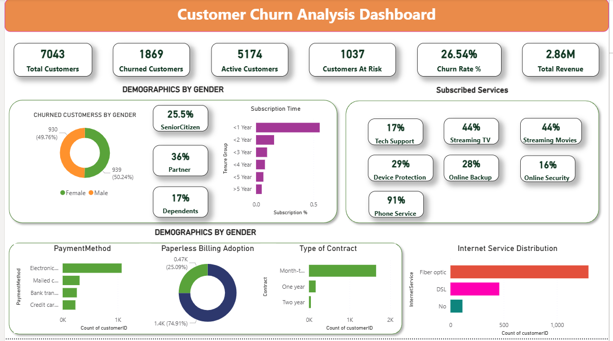

# 📊 Customer Churn Analysis Dashboard

## 🚀 Project Overview

This project analyzes customer churn behavior using data analytics and visualization. The dashboard helps identify key factors influencing churn and provides actionable insights to improve customer retention.

---

## 🎯 Objectives

* Analyze customer churn patterns
* Understand customer demographics and behavior
* Identify high-risk customer segments
* Provide data-driven business recommendations

---

## 📌 Key Metrics (KPIs)

* **Total Customers:** 7043
* **Churned Customers:** 1869
* **Active Customers:** 5174
* **Customers at Risk:** 1037
* **Churn Rate:** 26.54%
* **Total Revenue:** 2.86M

---

## 📊 Dashboard Features

### 1. Customer Demographics

* Gender-based churn distribution
* Senior citizen (25.5%), Partner (36%), Dependents (17%) analysis
* Customer tenure (subscription time) insights

### 2. Services Analysis

* Tech Support: 17%
* Streaming TV & Movies: 44% each
* Device Protection: 29%
* Online Backup: 28%
* Online Security: 16%
* Phone Service: 91%

### 3. Payment & Billing Insights

* Electronic payment methods are most commonly used
* Paperless billing adoption is high (~75%)

### 4. Contract Type Analysis

* Majority customers are on **month-to-month contracts**
* One-year and two-year contracts are significantly lower

### 5. Internet Service Distribution

* Fiber optic users are the highest
* DSL is moderate
* Few customers have no internet service

---

## 📊 Dashboard Preview

---

## 📈 Business Insights

### 🔍 1. High Churn Rate

* Churn rate is **26.54%**, indicating a significant retention issue

### 📅 2. Short Tenure Customers Churn More

* Customers with **less than 1 year** subscription show highest churn
* Early-stage engagement is critical

### 📑 3. Contract Type Drives Churn

* **Month-to-month customers churn the most**
* Long-term contracts improve retention

### 👴 4. Senior Citizens Segment

* **25.5% customers are senior citizens**, requiring better support and personalization

### 💳 5. Payment Behavior

* Electronic payment methods dominate usage
* Indicates strong digital adoption

### 📄 6. Paperless Billing Trend

* Around **75% customers use paperless billing**
* Suggests preference for digital services

### 🌐 7. Internet Service Pattern

* Fiber optic service has the highest usage
* Needs deeper analysis for satisfaction and churn impact

### 🛡️ 8. Low Adoption of Support Services

* Tech support (17%) and online security (16%) are low
* Customers without support services may be at higher churn risk

---

## 💡 Recommendations

* 🎯 Improve onboarding for new customers
* 📞 Increase adoption of tech support services
* 💰 Promote long-term contracts with discounts
* 🔐 Bundle security and backup services
* 📊 Enhance digital experience for billing and payments
* ⚡ Analyze fiber optic service quality

---

## 📌 Conclusion

The dashboard provides a comprehensive view of customer churn behavior. By focusing on high-risk segments and improving service offerings, businesses can reduce churn and increase customer lifetime value.

---

## 🛠️ Tools & Technologies

* **Power BI** – Built interactive dashboards and KPI visualizations
* **SQL** – Performed data aggregation and business query analysis
* **Excel** – Cleaned and prepared raw dataset
* **Python (Basic)** – Conducted exploratory data analysis (EDA)

---
